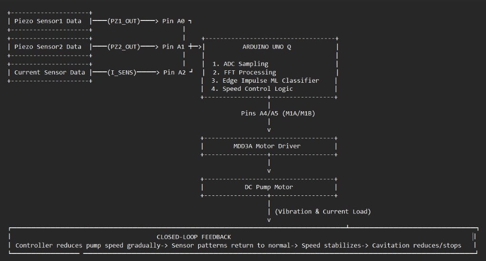
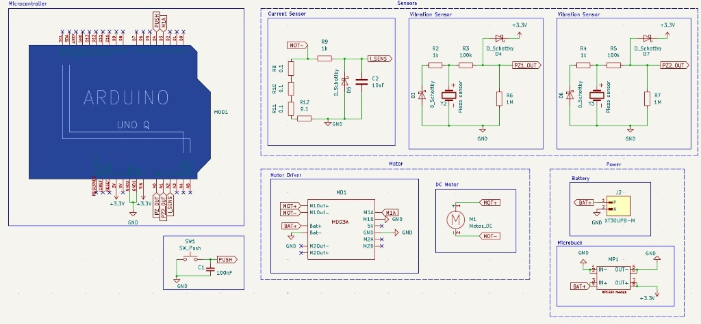
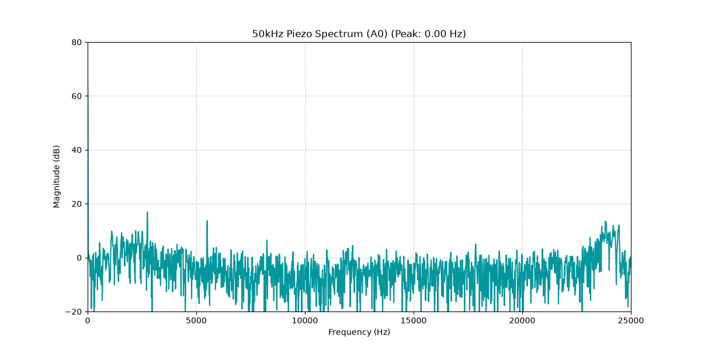

# Smart AIoT Cavitation Sentry & Autonomous Adaptive Pump Control System
### *Non-Invasive Hydrodynamic Cavitation Detection, Multi-Modal Sensor Fusion, and Edge Physical AI Closed-Loop Speed Control for Agricultural & Industrial Centrifugal Pumps*

**Submitted for:** DigiKey × Electronics For You (EFY) Design Challenge  
**Team Name:** ElectroDynamix  
**Institution:** Manipal Institute of Technology, Manipal Academy of Higher Education (MAHE), Manipal, Karnataka – 576104  

---

### Project Video Links
* **Primary Demonstration Video:** [YouTube Video Link](https://www.youtube.com/watch?v=X3MLUWcRTSs)
* **Full Hydraulic Experimentation Video:** [Google Drive Demonstration](https://drive.google.com/file/d/1NdSjHkZP5aevQ25KPRAulMcES6_8Juj5/view)

---

## 1. Executive Summary & Problem Statement

Agricultural tube-wells, borewells, and industrial centrifugal pumps are the operational backbone of irrigation and water supply systems. However, they frequently suffer from **cavitation**—a catastrophic fluid dynamics failure mode where static pressure drops below the fluid's vapor pressure ($P_{\\text{fluid}} < P_v$). 

When suction pressure plunges (due to seasonally dropping water tables, clogged suction strainers, piping air leaks, or oversized pump impellers), vapor bubbles form spontaneously at the impeller eye and implode violently in higher-pressure volute zones within microseconds. These micro-implosions produce shock waves and micro-jets exceeding **1 GPa (10,000 atmospheres)**, causing:
* Severe metal erosion, pitting, and catastrophic impeller blade perforation.
* High-frequency structural vibrations that destroy shaft mechanical seals and bearings.
* Loss of pump head, hydraulic efficiency collapse, and massive electrical waste.
* Unplanned pump replacement costs (₹15,000 to ₹75,000+ per borewell pump) and devastating crop irrigation loss.

Until now, farmers and plant operators had **no affordable, non-invasive method** to detect cavitation early before irreversible structural damage occurred.

---

## 2. Our Solution: Clip-On AIoT Physical Sentry

We have engineered an autonomous, low-cost, clip-on retrofit monitoring and control unit that straps onto any existing pump casing without requiring plumbing alterations or mechanical downtime.

### Key Technological Pillars:
1. **Multi-Modal Non-Invasive Sensing:**
   * **Dual Piezoelectric Vibration Pickups:** High-frequency casing vibration monitoring at suction (`PZ1`) and discharge (`PZ2`).
   * **Acoustic Sensor:** Captures airborne ultrasonic bubble-collapse "gravel crackle" emissions.
   * **Motor Current Shunt Sensing:** Detects instantaneous electrical load ripples caused by torque instability.
2. **Dual-Core Edge Physical AI Architecture:**
   * **Real-Time MCU Core (Zephyr RTOS):** Bare-metal 50,000 samples/sec (50 kHz) 14-bit ADC sampling, triple ring buffers, and onboard 4096-point Radix-2 FFT.
   * **High-Performance Linux SoC:** Connects via high-speed RouterBridge IPC, extracts 20 band-power energy features across the **8 kHz – 20 kHz cavitation spectrum**, and executes an on-device Random Forest classifier (89.44% accuracy).
3. **Closed-Loop Sense-Decide-Act Adaptive Control:**
   * Upon detecting cavitation, the system does not merely sound an alarm—it engages a **closed-loop PID controller** that modulates the motor driver PWM (or VFD 0-10V reference), slightly trimming pump speed to restore suction pressure above the vapor pressure threshold. Once sensor signatures normalize, optimal speed is automatically maintained.

---

## 3. Hardware Architecture & KiCad Schematic


*Fig 1. Edge Physical AI Block Diagram illustrating 50 kHz ADC acquisition, onboard FFT, RouterBridge IPC, Random Forest classifier, and closed-loop motor driver feedback.*


*Fig 2. Complete Hardware Circuit Schematic designed in KiCad.*

### Circuit Protection & Signal Conditioning Highlights:
* **Piezoelectric Transient Clamping:** 1 MΩ damping resistors with 100 kΩ series resistors and antiparallel **1N5822 Schottky barrier diodes** clamping transient spikes strictly between -0.3V and +3.6V, shielding microcontroller ADC inputs.
* **Low-Side Precision Current Shunt:** Four 0.1 Ω 3W SMD resistors in parallel ($R_{\\text{eq}} = 0.025\\ \\Omega$), rated for 12W continuous power, paired with a 1 kΩ + 10 µF RC filter to eliminate PWM motor commutation noise.
* **Power Regulation:** 3S 11.1V 4200 mAh LiPo battery stepping down to clean 5.0V via SmartElex MP1584 buck converter with star-point ground separation.

---

## 4. Software & Edge AI Architecture

```
AIoT-Cavitation-Detection-and-Adaptive-Control/
├── Firmware/
│   ├── MCU_ADC_FFT/           # Bare-metal Zephyr C++ firmware: 50 kHz ADC & 4096-pt FFT
│   └── Edge_Service/          # Linux Python daemon, RouterBridge IPC & CSV batch logger
├── Hardware/
│   ├── Cavitation_Schematic.kicad_sch  # Full KiCad schematic
│   └── circuit_schematic.jpg  # High-resolution schematic export
├── Machine_Learning/
│   ├── train_rf_classifier.ipynb # Scikit-Learn Random Forest training pipeline
│   ├── FEATURE_EXTRACTION_GUIDE.txt # Mathematical band-power extraction guide
│   └── dataset/               # 50 kHz raw & preprocessed cavitation benchmark CSVs
├── Dashboard/
│   └── high_speed_fft.png     # SCADA HMI dynamic telemetry waveform
└── docs/images/               # High-resolution prototype and testbed photography
```

### Feature Extraction in the 8–20 kHz Bubble-Collapse Zone:
Signal frames (100 ms, 5,000 samples at 50 kHz) are DC-corrected, windowed with a periodic Hann window, and transformed via real FFT. Power spectral density is integrated into 20 linearly-spaced bands across 8,000 Hz – 20,000 Hz:

$$E_b = \\sum_{f_k \\in \\text{band}_b} |X[k]|^2 \\quad \\text{for } b = 1, 2, \\dots, 20$$

### Machine Learning Benchmark Performance:
* **Acoustic Classifier (Crackle Sound):** **89.44% Accuracy** | F1-Score: 0.8948 | ROC-AUC: **0.9795**
* **Vibration Classifier (Casing Resonance):** **87.50% Accuracy** | Precision: 0.9125 | ROC-AUC: **0.9623**

---

## 5. SCADA HMI Live Telemetry Dashboard


*Fig 3. Real-time telemetry monitoring suction/discharge vibration, motor current, pump RPM, and dynamic risk index.*

---


## 7. License
Licensed under the Apache 2.0 License - Open Source for Agricultural and Industrial Sustainability.
